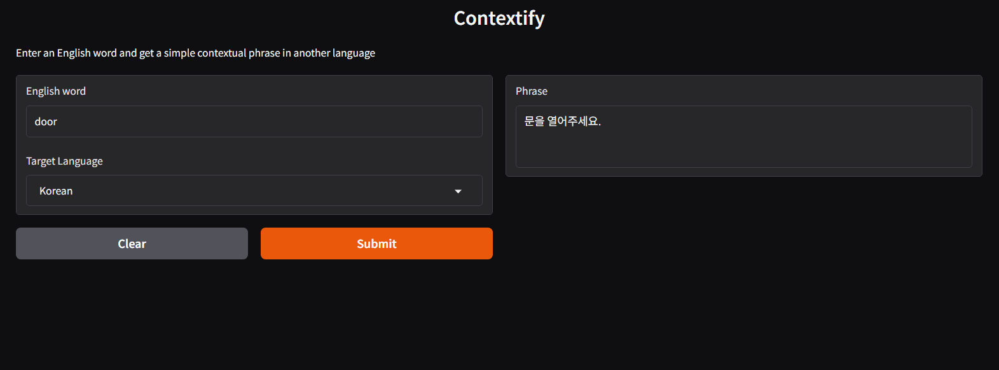

# Contextify



A language learning helper that generates simple contextual sentences for English words in your target language, powered by Qwen via HuggingFace.

## What it does

Enter an English word and select a target language — the app returns a short, beginner-friendly sentence using that word, helping you understand it in context.

**Supported languages:** Spanish, French, German, Korean, Japanese, Portuguese

## Setup

### 1. Install dependencies

```bash
pip install langchain langchain-huggingface gradio python-dotenv
```

### 2. Get a HuggingFace API token

Go to [huggingface.co/settings/tokens](https://huggingface.co/settings/tokens) and create a token with **Read** permissions.

### 3. Configure the environment

Create a `.env` file in the project root:

```
HUGGINGFACEHUB_API_TOKEN=your_token_here
```

### 4. Run the app

```bash
python main.py
```

The Gradio interface will open in your browser.

## Model

- **Model:** `Qwen/Qwen2.5-72B-Instruct`
- **Provider:** HuggingFace Inference API (via LangChain)
